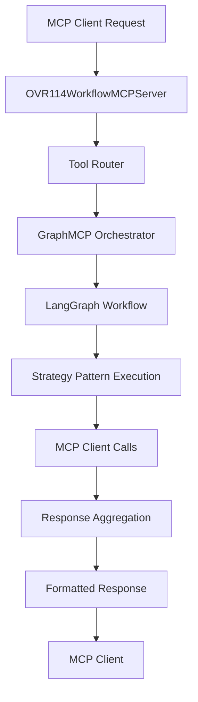
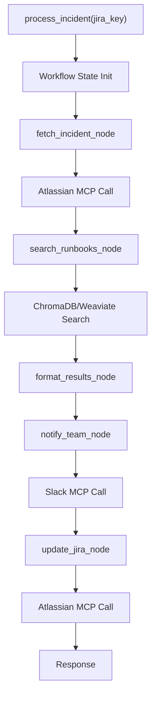
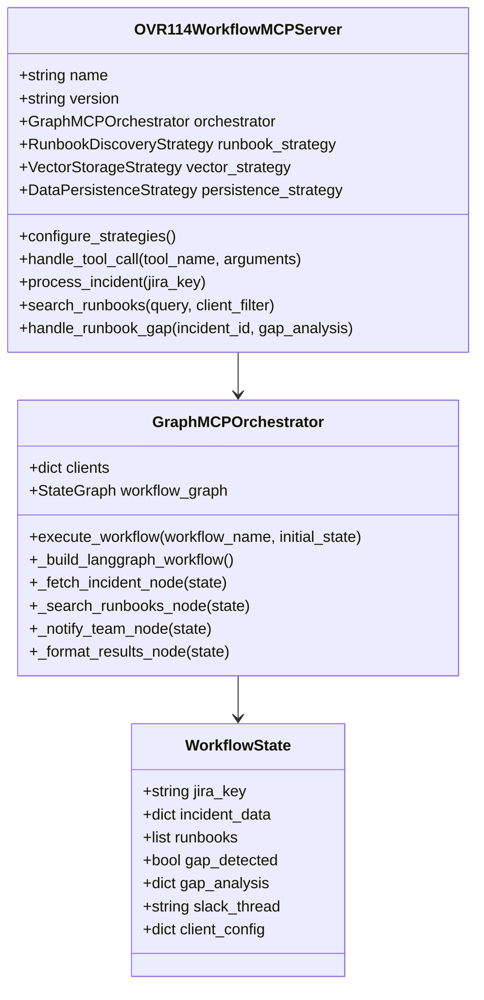
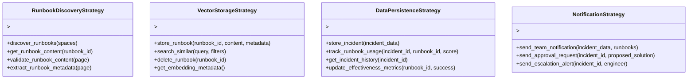
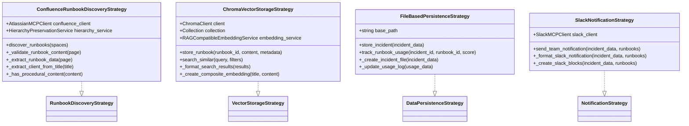
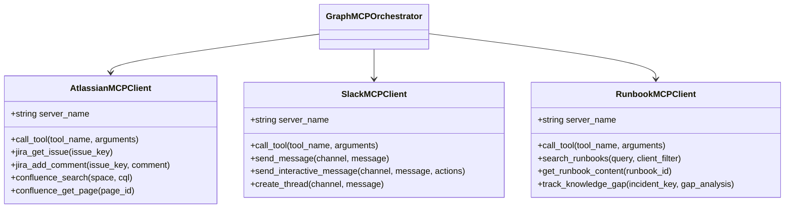
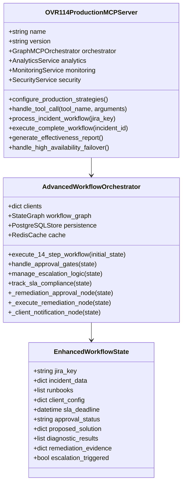
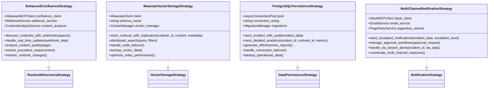
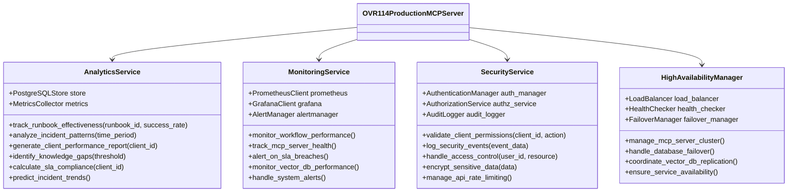
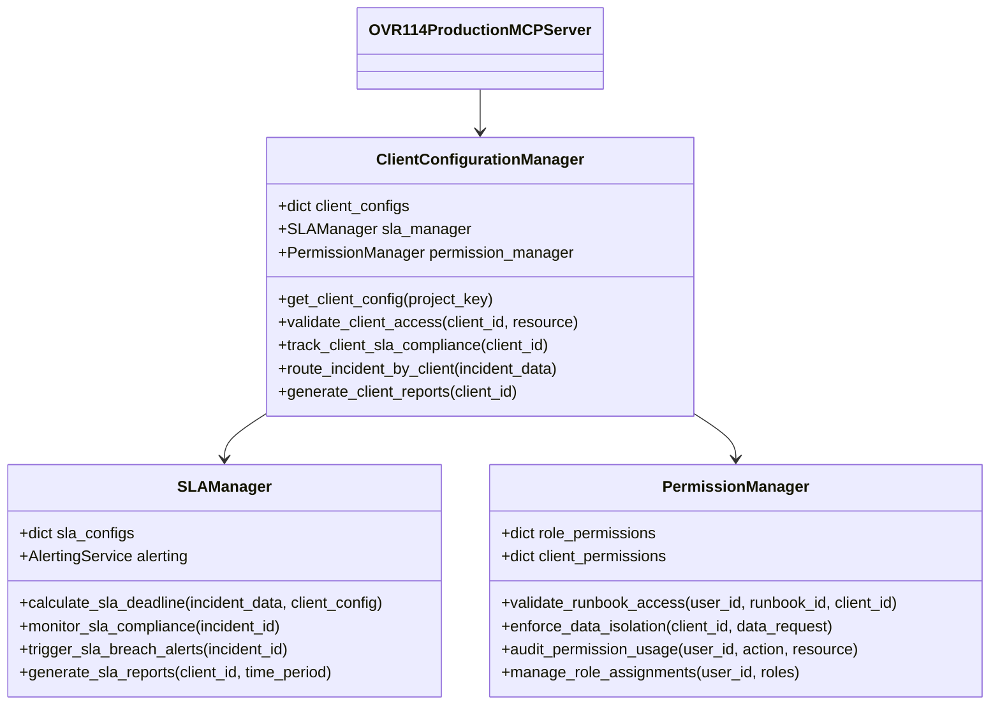

# OVR-114 Custom MCP Server Architecture

## Custom MCP Server Flow

### High-Level Workflow Orchestration

### Detailed MCP Server Flow

## Class Diagram for Prototype

### Core MCP Server Architecture

### Strategy Pattern Interfaces

### Prototype Strategy Implementations

### MCP Client Integration

## Class Diagram for Production

### Enhanced MCP Server Architecture

### Production Strategy Implementations

### Production Services Architecture

### Multi-Client Management

## Key Architectural Differences

### Prototype vs Production

| Component | Prototype | Production |
|-----------|-----------|------------|
| **MCP Server** | Single-threaded, basic error handling | Multi-threaded, comprehensive error handling |
| **Workflow Engine** | Simple LangGraph nodes | Complex approval gates and escalation |
| **Vector Storage** | ChromaDB (local) | Weaviate (distributed cluster) |
| **Persistence** | File-based storage | PostgreSQL with replication |
| **Monitoring** | Basic logging | Prometheus + Grafana + alerts |
| **Security** | None | Authentication, authorization, audit |
| **Scalability** | Single instance | Load balanced cluster |
| **Analytics** | None | Comprehensive effectiveness tracking |

### Strategy Evolution

The strategy pattern enables seamless evolution from prototype to production:

1. **Prototype Phase**: Simple, file-based implementations for rapid development
2. **Production Phase**: Enterprise-grade implementations with clustering, monitoring, and analytics
3. **Future Enhancement**: Easy addition of new strategies without workflow changes

This architecture provides a clear path from rapid prototyping to enterprise deployment while maintaining flexibility and extensibility throughout the evolution process.