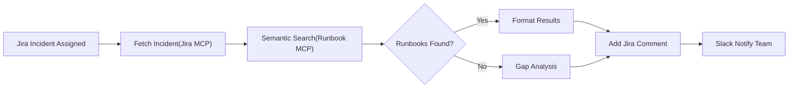
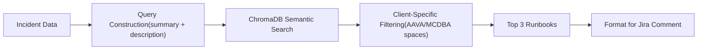

# OVR-114 Runbook Discovery & Incident Resolution Plan

## 1 | Goal  
Deliver an AI-assisted system that discovers Confluence runbooks, embeds them for semantic search, and orchestrates an incident workflow through Jira and Slack—first as a **prototype**, then as an **enterprise-grade** solution.

## 2 | Prototype (User Stories & Acceptance)

| # | Title | "As a / I want / So that" | Acceptance Highlights |
|---|-------|---------------------------|-----------------------|
| P-1 | Basic Workflow Orchestration | MC-DBA engineer ⟶ LangGraph workflow finds runbooks ⟶ I get suggestions instantly | - Jira ticket fetched- Top-3 runbooks returned- - Thread with action links |
| P-3 | Runbook Gap Detection | Engineer ⟶ know when no runbook fits ⟶ create missing docs | - Gap flagged if relevance - Gap stored for follow-up |

## 3 | Prototype (Architecture)

| Layer | Strategy Interface | Prototype Implementation | Swap-out Options |
|-------|-------------------|--------------------------|------------------|
| Runbook Discovery | `RunbookDiscoveryStrategy` | Confluence CQL search (title/text "runbook") | Git, SharePoint |
| Vector Storage | `VectorStorageStrategy` | ChromaDB local collection | Weaviate, Milvus |
| Doc Storage (Hierarchy) | `DocumentStorageStrategy` | Markdown files mirroring Confluence tree | Object store, Git |
| Orchestration | LangGraph via GraphMCP SDK | "Nodes: fetch → search → notify → comment" | Any workflow engine |
| Persistence | — *(prototype skips RDBMS)* | Files + Chroma metadata only | PostgreSQL layer in prod |

### 3.1 Prototype Workflow (flowchart)



## 4 | Post-Prototype (User Stories)

| # | Title | Key Extras (beyond prototype) |
|---|-------|------------------------------|
| Prod-1 | Full 14-Step Incident Workflow | Diagnostics, approval gates, remediation execution, client closure |
| Prod-2 | Real-Time Runbook Sync | Confluence webhooks, automatic vector refresh |
| Prod-3 | Effectiveness Analytics | Track runbook success, SLA metrics, trend dashboards |
| Prod-4 | High Availability | Weaviate cluster + PostgreSQL replication, health monitoring |

### 4.1 Target Production Workflow (simplified view)


## 5 | Implementation Roadmap

| Phase | Timeline | Deliverables |
|-------|----------|--------------|
| **Week 1** | - Build custom MCP server- Confluence discovery → ChromaDB ingest | P-1 user story satisfied |
| **Week 2** | - LangGraph e2e test on 2 Jira tickets- Slack notifications & gap detection | P-2 & P-3 satisfied |
| **Month 2** | - Swap ChromaDB → Weaviate- Add PostgreSQL analytics tables- Real-time runbook webhooks | Prod-1 & Prod-2 |
| **Month 3** | - Effectiveness reports- HA deployment (Weaviate cluster, PG replication) | Prod-3 & Prod-4 |

## 6 | User Story 1: Basic Workflow Orchestration (Detailed Tasks)

### Task Breakdown

| Task | Goal | Timeline | Success Metric |
|------|------|----------|---------------|
| **Task 1** | Core Workflow Infrastructure Setup | Week 1, Days 1-2 | Workflow compiles and MCP connects |
| **Task 2** | Incident Fetching & Processing Node | Week 1, Days 3-4 | Fetches incident data from test tickets |
| **Task 3** | Runbook Search & Results Integration | Week 1, Day 5 - Week 2, Day 1 | Returns top 3 relevant runbooks via ChromaDB |
| **Task 4** | End-to-End Workflow Execution & Testing | Week 2, Days 2-3 | End-to-end execution  B["WorkflowState Definition"]
    B --> C["GraphMCP Client Init"]
    C --> D["Atlassian MCP Connection"]
    D --> E["Basic START → END Flow"]
```

### Task 3: ChromaDB Integration



## 7 | Expandability Highlights

* **Strategy Pattern:** any layer (discovery, vector, storage) can be hot-swapped without touching workflow logic.  
* **GraphMCP Nodes:** each workflow step is a first-class node—new paths (e.g., PagerDuty alerts) are added declaratively.  
* **RAG-Ready Embeddings:** embeddings use OpenAI *text-embedding-3-large* (1536-D, cosine norm) ensuring drop-in compatibility with future RAG engines.

## 8 | Prototype Definition of Done

1. **Runbooks discovered** from AAVA & MCDBA, hierarchy preserved on disk.  
2. **Two Jira tickets** processed end-to-end with top-3 runbook links added.  
3. **Slack alert** shows incident + runbook list within 5 s of comment.  
4. **Unit tests** cover discovery, embedding, search, and workflow routing.  
5. **Replaceability demo:** swap ChromaDB→mock store in <15 min with no workflow edits.

## 9 | Technical Stack Summary

| Component | Prototype | Production |
|-----------|-----------|------------|
| **Workflow Engine** | LangGraph + GraphMCP | LangGraph + GraphMCP |
| **Vector Storage** | ChromaDB (local) | Weaviate (distributed cluster) |
| **Runbook Discovery** | Confluence CQL search | Confluence + webhooks |
| **Persistence** | Files + metadata | PostgreSQL + audit trail |
| **Embeddings** | OpenAI text-embedding-3-large | OpenAI text-embedding-3-large |
| **MCP Integration** | Atlassian, Slack servers | Atlassian, Slack, Custom servers |

This plan delivers a lean prototype that can evolve—step-by-step—into a full production system while keeping every component replaceable and future-proof.